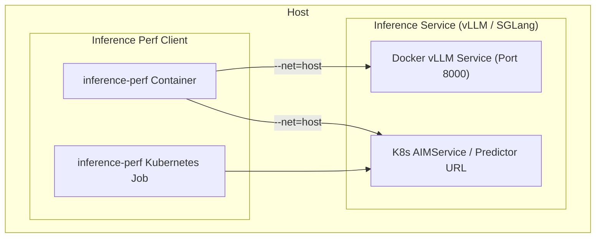

# Benchmarking AMD Enterprise AI Serving Endpoints

**AMD Enterprise AI Reference Stack | June 2026**

This guide provides step-by-step instructions for benchmarking LLM inference performance against an AMD Enterprise AI (EAI) model-serving endpoint using the Kubernetes-sigs `inference-perf` tool. The flow is designed to mirror standard LLM serving benchmarks while staying aligned with AMD EAI deployments on MI300X and MI355X platforms.

The benchmark client runs from either a Docker container or an in-cluster Kubernetes Job and targets the model-serving endpoint directly. `inference-perf` is intended for production-scale GenAI inference benchmarking and provides a configurable workload runner for endpoint testing.

For normal POC runs, prefer the checked-in automation:

```bash
./scripts/benchmark.sh --mode perf
./scripts/benchmark.sh --mode accuracy
./scripts/benchmark.sh --mode all
```

The manual examples below are useful when you need to customize the benchmark runner or run outside the repository script.

### Targeting an endpoint

`benchmark.sh` picks the endpoint in this order:

1. `--target-url URL` — use an explicit endpoint (skips auto-detect).
2. `--port-forward SVC` — for the **raw `deploy.sh` track**, automatically
   `kubectl port-forward`s the Service, waits until `/v1/models` is ready, runs
   the benchmark against `localhost`, and tears the forward down on exit:

   ```bash
   ./scripts/benchmark.sh --mode all --port-forward gpt-oss-120b-aim
   # override defaults if needed:
   ./scripts/benchmark.sh --mode perf --port-forward gpt-oss-120b-aim \
     --namespace default --local-port 8000
   ```

   `--port-forward` and `--target-url` are mutually exclusive.
3. **Auto-detect (default).** With no endpoint flags, it discovers the deployed
   model, preferring the **`deploy.sh` raw track**:
   1. an available `<model>-aim` Deployment (from `deploy.sh`) — targeted via its
      Service **ClusterIP** directly, so a bare `benchmark.sh` hits whatever
      `deploy.sh` last brought up;
   2. otherwise a Ready operator-track (`start.sh`) `InferenceService` predictor
      (via its ClusterIP);
   3. otherwise `http://localhost:8000` (local Docker endpoint).

   Namespace defaults to `default`; override with `--namespace`.

   > Auto-detect uses the ClusterIP rather than `kubectl port-forward` because a
   > port-forward tunnel drops connections under the long, high-concurrency
   > accuracy eval (`ServerDisconnectedError`). If this host cannot route to
   > cluster IPs (e.g. a remote kubeconfig), use `--port-forward <svc>` instead.

---

## Overview and Architecture

To evaluate latency and throughput, run the benchmark client against the model-serving endpoint from either the host or the cluster.



The client sweeps concurrency levels, collects latency and throughput metrics, and exports reports to a local results directory or persistent volume.

### Key Metrics


| Metric | Full Name | What it measures |
| :--- | :--- | :--- |
| **TTFT** | Time To First Token | Time from request submission to the first output token. Captures queuing delay, prefill time, and network round-trip. |
| **ITL** | Inter-Token Latency | Average delay between consecutive output tokens (also called TPOT). Determines streaming smoothness after the first token. |
| **e2e latency** | End-to-End Request Latency | Total time from request submission to final token. Calculated as `TTFT + generation_time`. |
| **TPS** | Tokens Per Second | Output token throughput over the benchmark window. Per-user TPS = `output_length / e2e_latency`. |
| **RPS** | Requests Per Second | Complete inference requests processed per second under load. |

> [!TIP]
> **Which metric matters most for your use case?**
> - **Interactive / chat applications** → minimize **TTFT** and **ITL**.
> - **Batch / offline processing** → maximize **TPS** and **RPS**.
> - **SLA-bounded deployments** → use **e2e_latency p99** as the binding constraint.

### Benchmark Parameters & Best Practices


#### Input and Output Sequence Lengths (ISL / OSL)

Sequence lengths strongly influence benchmark results.

- **ISL** (Input Sequence Length) controls prompt size and directly raises TTFT as it increases KV-cache construction time.
- **OSL** (Output Sequence Length) controls generated token count and raises ITL and e2e latency as generation bandwidth pressure grows.

Use ISL/OSL pairs that reflect your target workload:

| Use Case | ISL | OSL | Dominant Metric |
| :--- | :---: | :---: | :--- |
| Generation (code / story / email) | short | long | ITL, TPS |
| Translation | medium | medium | TTFT, ITL |
| Summarization / RAG | long | short | TTFT |

This guide benchmarks: **Generation** (1024/8192), **Translation** (1024/1024), **Summarization** (8192/1024).

#### Concurrency

Concurrency is the number of requests served simultaneously. Increasing concurrency usually improves throughput until the GPU or memory subsystem saturates, after which latency rises sharply. Sweep a range such as `1, 2, 4, 8, 16, 32` to identify the performance knee.

#### Warmup

Always run a warmup pass before timed measurements. Warmup initializes the serving stack, compiles HIP kernels (AMD), and prefills caches so cold-start effects do not skew results. The sweep script in Step 3 runs warmup automatically.

#### Request Count

Use at least `concurrency × 3` requests per stage, with a minimum of 30 requests for low-concurrency stages. For large OSL scenarios (e.g., Generation OSL=8192), increase the count if p99 latency appears noisy.

### Expected Durations

| Activity | Typical Duration | Notes |
| :--- | :--- | :--- |
| Endpoint startup with `scripts/start.sh` and warm cache | 5-20 minutes | Includes stopping any previous model, GPU release, pod scheduling, model load, and smoke test |
| Endpoint startup with first model download | 15-60+ minutes | `start.sh` validates `HF_TOKEN` / `HUGGING_FACE_HUB_TOKEN` before the AIM cache download starts |
| Llama 3.3 70B readiness after pod starts | 5-15 minutes | Weight load and server initialization can continue after the pod reaches `Running` |
| Mixtral 8x22B readiness after pod starts | 10-30 minutes | Requires all 8 GPUs; any existing GPU-serving pod must be stopped first |
| Single endpoint smoke test | Seconds to 1 minute | `/v1/models` and a short `/v1/completions` request should respond once ready |
| `scripts/benchmark.sh --mode perf` | 30-180+ minutes | Warmup plus all use cases and concurrency stages; long OSL tests dominate runtime |
| `scripts/benchmark.sh --mode accuracy` | 30-90+ minutes | MMLU/GSM8K via `lm_eval`; model size and batch auto-tuning affect runtime |
| Full `scripts/benchmark.sh --mode all` | 60-270+ minutes | Runs performance and accuracy paths sequentially |

Treat `Pending` as a scheduling/resource problem after a few minutes. Treat `Running` but not `Ready` as normal model initialization at first; investigate with pod logs if it remains that way beyond the ranges above.

---

## Step 1: Set Up the Serving Endpoint

Before benchmarking, deploy the model-serving endpoint. AMD Enterprise AI can run the model either inside Kubernetes using the AIM operator or directly on the host with Docker.

If you have not prepared the repository Python environment yet, run:

```bash
./setup.sh
source .eai-rocm-venv/bin/activate  # or .eai-cpu-venv / .eai-cuda-venv
```

`setup.sh` installs base packaging tools and any `requirements.txt` present at the repository root. If no requirements file exists, `scripts/benchmark.sh --mode accuracy` checks for `lm_eval` and `tenacity` and installs `lm_eval[vllm,api]` lazily.

### Flow A: Kubernetes Flow (Recommended)

The repository helper is the preferred path for one-model-at-a-time benchmarking:

```bash
# Default model: llama-3-3-70b
./scripts/start.sh

# Benchmark Mixtral instead; the script stops any previously running model first
./scripts/start.sh --model mixtral-8x22b
```

`start.sh` loads `scripts/.env`, validates Hugging Face access if a cache download is required, waits for cache readiness, waits for the active predictor endpoint, and prints `TARGET_URL` / `MODEL_ID`.

1. **Verify GPU availability in the cluster.**
   ```bash
   kubectl get nodes -o json \
     | jq -r '.items[] | "\(.metadata.name): \(.status.allocatable["amd.com/gpu"]) GPU(s)"'
   ```

2. **Deploy the `AIMService` resource.**

   Prefer the repository launcher:

   ```bash
   ./scripts/start.sh --model llama-3-3-70b
   ```

   It applies MI355X custom model/template resources before creating the AIMService. If you create a manual image-based manifest instead, include `allowUnoptimized: true` on MI355X:

   ```yaml
   apiVersion: aim.silogen.ai/v1alpha1
   kind: AIMService
   metadata:
     name: llama-3-3-70b
     namespace: default
   spec:
     model:
       name: llama-3-3-70b-instruct
       image: docker.io/amdenterpriseai/aim-meta-llama-llama-3-3-70b-instruct:0.11.0
     allowUnoptimized: true # Required for manual image-based MI355X manifests
   ```

   Apply a manual manifest only when you intentionally bypass `start.sh`:
   ```bash
   kubectl apply -f scripts/aim_service_llama.yaml
   ```

3. **Monitor deployment progress.**
   ```bash
   watch -n 5 'kubectl get pods -n default'
   kubectl logs -l aim.eai.amd.com/service.name=llama-3-3-70b -n default -f --tail=50
   ```

4. **Identify the predictor URL.**

   Once the service is `Ready`:
   ```bash
   MODEL_NAME=$(kubectl get inferenceservice -n default -o json \
     | jq -r '.items[] | select(.status.conditions[]? | select(.type=="Ready" and .status=="True")) | .metadata.name' 2>/dev/null)

   SERVICE_IP=$(kubectl get svc "${MODEL_NAME}-predictor" -n default \
     -o jsonpath='{.spec.clusterIP}' 2>/dev/null)
   echo "Predictor URL: http://${SERVICE_IP}"
   ```

   For this guide, the example model is `mistralai/Mixtral-8x22B-Instruct-v0.1` and predictor URL is `http://10.243.110.119`.

> **See also:** [QUICKSTART.md](QUICKSTART.md) for full POC model manifests, and [DEBUG.md](DEBUG.md) for common `AIMService` issues.

---

### Flow B: Docker Flow (Standalone Host)

For standalone testing, run the serving engine on the host with ROCm.

> [!IMPORTANT]
> **ROCm Version:** Use a ROCm **7.0.2** compatible image. `--max-model-len` must cover your largest ISL+OSL combination. For the default use cases (up to 8192+1024 tokens), set it to at least `16384`.

1. **Verify ROCm access.**
   ```bash
   rocm-smi
   ```

2. **Start the vLLM container.**
   ```bash
   export MODEL_ID="mistralai/Mixtral-8x22B-Instruct-v0.1"
   export HF_HOME=~/.cache/huggingface
   mkdir -p "$HF_HOME"

   docker run -d --name vllm-serving \
     --device=/dev/kfd --device=/dev/dri \
     --ipc=host \
     --shm-size=16gb \
     --group-add video \
     --cap-add=SYS_PTRACE \
     --security-opt seccomp=unconfined \
     -v "$HF_HOME:/root/.cache/huggingface" \
     -p 8000:8000 \
     rocm/vllm-openai:rocm7.0.2_instinct_vllm_0.8.4 \
     vllm serve "$MODEL_ID" \
     --tensor-parallel-size 8 \
     --max-model-len 16384
   ```

3. **Watch the logs until startup completes.**
   ```bash
   docker logs -f vllm-serving
   ```
   Wait until you see:
   ```text
   INFO:     Application startup complete.
   INFO:     Uvicorn running on http://0.0.0.0:8000 (Press CTRL+C to quit)
   ```

---

### Verify Endpoint Connectivity

Confirm the endpoint is reachable before benchmarking.

```bash
SERVICE_URL="http://${SERVICE_IP}"   # K8s flow
# SERVICE_URL="http://localhost:8000"  # Docker flow: uncomment if using standalone vLLM

# Fetch available models
curl -s "${SERVICE_URL}/v1/models" | jq -r '.data[0].id'
```

Smoke-test a completion request:

```bash
MODEL_ID=$(curl -s "${SERVICE_URL}/v1/models" | jq -r '.data[0].id')
curl -s -X POST "${SERVICE_URL}/v1/completions" \
  -H "Content-Type: application/json" \
  -d "{
    \"model\": \"${MODEL_ID}\",
    \"prompt\": \"Summarize the key risks in high-frequency trading in 3 bullets.\",
    \"max_tokens\": 128
  }" | jq
```

---

## Step 2: Set Up the Benchmarking Tool

Use the `inference-perf` container as the benchmark runner. It can run on the host via Docker or inside the cluster as a Kubernetes Job.

### Benchmark Configuration File

Create `scripts/benchmark_config.yaml`:

```yaml
server:
  type: "vllm"
  # Substitute ${SERVICE_IP} with your predictor ClusterIP (K8s) or use localhost:8000 (Docker).
  # Do NOT append /v1 — the client appends this automatically.
  base_url: "http://${SERVICE_IP}"
  model_name: "mistralai/Mixtral-8x22B-Instruct-v0.1"

tokenizer:
  # NOTE: gpt2 is used as a fallback tokenizer for synthetic token count estimation.
  # For accurate counts with Mixtral (SentencePiece), set to the model name and ensure
  # your HF_TOKEN is set for gated model access.
  pretrained_model_name_or_path: "gpt2"

data:
  type: "synthetic"
  input_distribution:
    type: "fixed"
    mean: 200
  output_distribution:
    type: "fixed"
    mean: 32

load:
  type: "concurrent"
  num_workers: 4 # Keep low to avoid system file descriptor limits
  stages:
    - num_requests: 10
      concurrency_level: 1
    - num_requests: 20
      concurrency_level: 4

storage:
  local_storage:
    path: "/workspace/reports"
```

> [!WARNING]
> **Base URL Suffix:** Do **not** append `/v1` to `base_url`. The client appends the API path automatically — requests will return HTTP 404 if `/v1` is included.

> [!IMPORTANT]
> **File Descriptor Limit:** Keep `num_workers` at `4` or `8`. Setting it to high values (e.g., 256) triggers `OSError: [Errno 24] No file descriptors available`.

---

### Docker Benchmarking Flow

```bash
mkdir -p results/benchmarks

docker run --rm --net=host \
  -v "$(pwd)/scripts/benchmark_config.yaml:/workspace/config.yml" \
  -v "$(pwd)/results/benchmarks:/workspace/reports" \
  quay.io/inference-perf/inference-perf
```

For debug logging:
```bash
docker run --rm --net=host \
  -v "$(pwd)/scripts/benchmark_config.yaml:/workspace/config.yml" \
  -v "$(pwd)/results/benchmarks:/workspace/reports" \
  quay.io/inference-perf/inference-perf \
  python inference_perf/main.py --config_file config.yml --log-level DEBUG
```

---

### Kubernetes Benchmarking Flow

1. **Create a ConfigMap for the config file.**
   ```bash
   kubectl create configmap benchmark-config \
     --from-file=config.yml=scripts/benchmark_config.yaml \
     -n default
   ```

2. **Apply the benchmark Job.**

   > [!IMPORTANT]
   > Results are stored on a Longhorn `PersistentVolumeClaim` so they survive pod termination. Use `kubectl cp` to extract them after the job completes.

   Create `scripts/benchmark_job.yaml`:
   ```yaml
   apiVersion: v1
   kind: PersistentVolumeClaim
   metadata:
     name: benchmark-results-pvc
     namespace: default
   spec:
     accessModes:
       - ReadWriteOnce
     storageClassName: longhorn
     resources:
       requests:
         storage: 5Gi
   ---
   apiVersion: batch/v1
   kind: Job
   metadata:
     name: inference-perf-benchmark
     namespace: default
   spec:
     template:
       spec:
         containers:
         - name: client
           image: quay.io/inference-perf/inference-perf:latest
           volumeMounts:
           - name: config-volume
             mountPath: /workspace/config.yml
             subPath: config.yml
           - name: results-volume
             mountPath: /workspace/reports
         restartPolicy: Never
         volumes:
         - name: config-volume
           configMap:
             name: benchmark-config
         - name: results-volume
           persistentVolumeClaim:
             claimName: benchmark-results-pvc
     backoffLimit: 1
   ```

   Apply it:
   ```bash
   kubectl apply -f scripts/benchmark_job.yaml
   ```

3. **Watch logs.**
   ```bash
   kubectl logs -f job/inference-perf-benchmark
   ```

4. **Copy results back to the host.**
   ```bash
   mkdir -p results/benchmarks
   JOB_POD=$(kubectl get pods -n default -l job-name=inference-perf-benchmark \
     -o jsonpath='{.items[0].metadata.name}')
   kubectl cp "default/${JOB_POD}:/workspace/reports" results/benchmarks/
   echo "Results extracted to results/benchmarks/"
   ```

---

## Step 3: Sweep Workloads

Use the checked-in benchmark script to generate benchmark configs for several sequence-length pairs and concurrency levels automatically:

```bash
./scripts/benchmark.sh --mode perf
```

Override endpoint or model detection when needed:

```bash
TARGET_URL=http://10.243.110.119 MODEL_ID=mistralai/Mixtral-8x22B-Instruct-v0.1 \
  ./scripts/benchmark.sh --mode perf
```

Run accuracy only or both paths:

```bash
./scripts/benchmark.sh --mode accuracy
./scripts/benchmark.sh --mode all
```

Expect the first warmup stage to be slower than later stages because AMD kernels and serving caches are initialized before timed measurements.

---

## Step 4: Analyze Performance Results

Upon completion, the tool exports structured outputs organized by use case and concurrency level:

```text
results/benchmarks/sweep/
└── Generation/
    ├── CON1/
    │   ├── config.yaml
    │   ├── summary_lifecycle_metrics.json
    │   └── stage_0_lifecycle_metrics.json
    ├── CON4/
    │   ├── config.yaml
    │   ├── summary_lifecycle_metrics.json
    │   └── stage_0_lifecycle_metrics.json
    └── ...
```

### Parsing Metrics with Python

Parse each `summary_lifecycle_metrics.json` across all concurrencies, extract TPS and TTFT, and write a consolidated `sweep_results.json`:

```python
import os
import json

use_case = "Generation"
concurrencies = [1, 2, 4, 8, 16, 32]
base_dir = f"results/benchmarks/sweep/{use_case}"

print(f"Metrics for Use Case: {use_case}")
print(f"{'Concurrency':<12} | {'Throughput (tokens/s)':<22} | {'Avg TTFT (s)':<12}")
print("-" * 55)

sweep_data = []

for con in concurrencies:
    report_path = os.path.join(base_dir, f"CON{con}", "summary_lifecycle_metrics.json")
    if os.path.exists(report_path):
        with open(report_path, "r") as f:
            metrics = json.load(f)

        tps = metrics.get("throughput", {}).get("total_tokens_per_sec", 0.0)
        avg_ttft = metrics.get("request_latency", {}).get("mean", 0.0)

        print(f"{con:<12} | {tps:<22.2f} | {avg_ttft:<12.3f}")
        sweep_data.append({"concurrency": con, "throughput": tps, "ttft": avg_ttft})
    else:
        print(f"{con:<12} | {'N/A (Missing File)':<22} | {'N/A':<12}")

output_path = os.path.join(base_dir, "sweep_results.json")
with open(output_path, "w") as f:
    json.dump(sweep_data, f, indent=2)
print(f"\nConsolidated sweep results saved to: {output_path}")
```

---

### Plotting the Latency-Throughput Curve

Read the generated `sweep_results.json` and plot the latency-throughput curve:

```python
import os
import json
import matplotlib.pyplot as plt

use_case = "Generation"
results_file = f"results/benchmarks/sweep/{use_case}/sweep_results.json"

if not os.path.exists(results_file):
    print(f"Error: {results_file} not found. Run the parser script first.")
    exit(1)

with open(results_file, "r") as f:
    sweep_data = json.load(f)

concurrencies = [item["concurrency"] for item in sweep_data]
ttft_seconds  = [item["ttft"]        for item in sweep_data]
tps_tokens_sec = [item["throughput"] for item in sweep_data]

plt.figure(figsize=(10, 6))
plt.plot(ttft_seconds, tps_tokens_sec, marker='o', color='#005A9C', linewidth=2, label="EAI Scaling Curve")

for i, con in enumerate(concurrencies):
    plt.text(ttft_seconds[i], tps_tokens_sec[i], f" C={con}",
             ha='left', va='bottom', fontsize=9, fontweight='semibold')

plt.title(f"Latency vs. Throughput — {use_case} (AMD Enterprise AI)", fontsize=14, fontweight='bold', pad=15)
plt.xlabel("Average Time to First Token (TTFT in seconds)", fontsize=11, labelpad=10)
plt.ylabel("Total System Throughput (Tokens per second)", fontsize=11, labelpad=10)
plt.grid(True, linestyle="--", alpha=0.6)
plt.legend()
plt.tight_layout()

output_png = f"results/benchmarks/sweep/{use_case}/latency_throughput_curve.png"
plt.savefig(output_png, dpi=150, bbox_inches='tight')
print(f"Plot saved to: {output_png}")
plt.show()
```

---

### Interpreting the Results

The latency-throughput curve plots TTFT (x-axis) against total system throughput (y-axis). Each point corresponds to a different concurrency value.

1. **Under SLA constraints:** Find your maximum acceptable TTFT on the X-axis, trace up to the curve, and read off the throughput and concurrency at that point.
2. **Finding the saturation knee:** Observe where throughput gains flatten while latency rises sharply. This is the optimal concurrency operating point for a given SLA.
3. **Alternative X-axes:** Plot ITL or e2e latency on the X-axis to expose different dimensions of the tradeoff.

---

## Step 5: Evaluate Accuracy

Performance benchmarks measure *speed* — accuracy benchmarks measure *correctness*. Use `lm-evaluation-harness` to validate model quality on standard tasks and compare results between hardware platforms.

### Benchmarks

| Benchmark | Task | Format | What it tests |
| :--- | :--- | :--- | :--- |
| **MMLU** | Massive Multitask Language Understanding | 5-shot multiple choice | Academic knowledge across 57 subjects |
| **GSM8K** | Grade School Math 8K | 5-shot chain-of-thought | Multi-step arithmetic reasoning |

### Prerequisites

```bash
./setup.sh
source .eai-rocm-venv/bin/activate  # or your detected venv
python -m pip install "lm_eval[vllm,api]"
```

> [!IMPORTANT]
> `scripts/benchmark.sh --mode accuracy` uses lm-evaluation-harness through the OpenAI-compatible completions endpoint (`local-completions`). Ensure the endpoint is reachable and `MODEL_ID` resolves from `/v1/models`, or pass `--target-url` and `--model-id` explicitly.

### Running the Evaluation

```bash
python -m lm_eval \
  --model local-completions \
  --model_args model="${MODEL_ID}",base_url="${TARGET_URL}/v1/completions",num_concurrent=16,tokenized_requests=False,tokenizer="${MODEL_ID}" \
  --tasks gsm8k,mmlu \
  --num_fewshot 5 \
  --batch_size 1 \
  --gen_kwargs max_gen_toks=2048 \
  --output_path results/accuracy/
```

> [!NOTE]
> - The checked-in script writes an `accuracy_summary.json` after parsing the latest harness output.
> - Full MMLU (14,079 questions) + GSM8K (1,319 samples) typically takes **30–90 minutes** depending on model size.

### Parsing Results

```python
import json, glob

result_files = sorted(glob.glob("results/accuracy/**/*.json", recursive=True))
with open(result_files[-1], "r") as f:
    data = json.load(f)

results = data.get("results", {})

mmlu_scores = [v["acc,none"] for k, v in results.items() if k.startswith("mmlu_")]
mmlu_avg = sum(mmlu_scores) / len(mmlu_scores) if mmlu_scores else results.get("mmlu", {}).get("acc,none")
print(f"MMLU 5-shot accuracy:     {mmlu_avg:.4f}")

gsm = results.get("gsm8k", {})
print(f"GSM8K strict-match:       {gsm.get('exact_match,strict-match', 'N/A'):.4f}")
print(f"GSM8K flexible-extract:   {gsm.get('exact_match,flexible-extract', 'N/A'):.4f}")
```

### Capturing Server-Side Errors (HTTP 500)

`lm_eval` only sees an opaque `500 Internal Server Error` when a request fails, and the
real traceback rotates out of the pod log quickly under the high request volume of an
accuracy run. To preserve it, `scripts/benchmark.sh` **streams the serving pod's own logs to
a file for the duration of the accuracy phase** and, if `lm_eval` exits non-zero, scans the
capture for the fatal signature and prints a focused excerpt.

This needs no extra flags — the pod is identified from the same auto-detection used for the
endpoint (raw `deploy.sh` `app=<model>-aim`, or the operator `serving.kserve.io/inferenceservice=<name>`).
When you override the endpoint with `--target-url` (so the pod is unknown), pass
`--port-forward <svc>` instead to keep log capture working.

Artifacts written under `results/accuracy/`:

| File | Contents |
| :--- | :--- |
| `server.pod.log` | Full server-side log streamed during the eval (always written) |
| `server_error.signature.log` | Matched error lines (NaN/Inf, `not JSON compliant`, tracebacks, 500s) — only on failure |

When the capture matches `Out of range float values are not JSON compliant` / NaN logprobs,
the script prints a **ROOT CAUSE CONFIRMED** banner. The run then exits with code **4** so
automation notices the accuracy failure (perf-only "no data" failures still exit **3**).

---

## Next Steps

After a benchmark run:

1. **Archive the results** — keep the sweep JSON/CSV and `accuracy_summary.json` together with the environment details (model, image tags, ROCm version, GPU count) so runs are comparable later.
2. **Investigate anomalies** — if throughput, latency, or accuracy look off, confirm the endpoint is healthy with `scripts/check.sh` (**[CHECK.md](CHECK.md)**), then diagnose with `scripts/debug.sh` and the state-driven flow in **[DEBUG.md](DEBUG.md)**.
3. **Compare configurations** — switch models or GPU/TP configs with `scripts/start.sh --model <name>` and re-run the sweep.

> [!NOTE]
> A slow first request is expected (one-time `aiter` JIT compilation). The benchmark warmup pass absorbs this — see **[DEBUG.md](DEBUG.md)** Section 3.

---

## Further Reading

| Resource | Link |
| :--- | :--- |
| EAI Install Guide | [INSTALL.md](INSTALL.md) |
| Quickstart & Model Manifests | [QUICKSTART.md](QUICKSTART.md) |
| Sanity-Checking Serving | [CHECK.md](CHECK.md) |
| Debugging AIMService | [DEBUG.md](DEBUG.md) |
| Official EAI Docs | [enterprise-ai.docs.amd.com](https://enterprise-ai.docs.amd.com/en/latest/) |
| lm-evaluation-harness | [github.com/EleutherAI/lm-evaluation-harness](https://github.com/EleutherAI/lm-evaluation-harness) |
