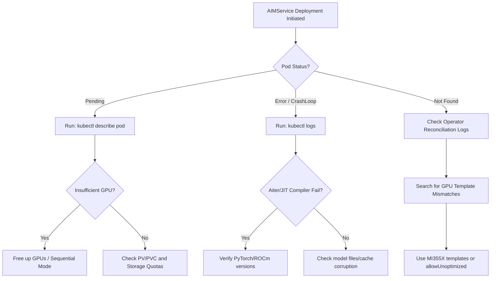

# AMD Enterprise AI (EAI) Troubleshooting Guide

This document outlines the symptoms, diagnostic flows, and resolutions for issues encountered during AMD Enterprise AI MI355X POC deployment and verification phases.

---

## 1. Diagnostics Flow Overview

The following workflow illustrates the general debugging path for any failing `AIMService` or `AIMModelCache` resources:



---

## 2. Issue Categories & Resolutions

### Issue 1: Model Template Mismatch / GPU Model Restriction

> [!IMPORTANT]
> **Symptom**: `AIMService` is created but the corresponding predictor pod is never scheduled, or the custom resource status reports configuration errors. Checking the operator logs (`kaiwo-controller-manager`) reveals template validation errors for the `mi355` GPU model.

#### Debugging Flow for Template Mismatch

1. Run the service diagnostic helper to list status:

   ```bash
   ./scripts/debug.sh --list
   ```

2. Retrieve active reconciler logs to identify the mismatch:

   ```bash
   ./scripts/debug.sh <service-name> default
   ```

3. Locate the error message in the operator logs:

   ```text
   "error": "template validation failed: gpu model mi300 requested but mi355 found in cluster"
   ```

#### Resolution for Template Mismatch

By default, the EAI operator catalog templates are optimized for specific hardware profiles (e.g. `mi300`). This repository's normal POC flow avoids that mismatch by applying custom MI355X `AIMClusterServiceTemplate` resources from `scripts/custom-templates.yaml` before creating model-ref `AIMService` resources.

Use the scripted path first:

```bash
./scripts/start.sh --model mixtral-8x22b
```

If you create ad hoc image-based AIMService manifests outside the scripted flow, explicitly allow the operator to use a generic/unoptimized configuration:

```yaml
apiVersion: aim.silogen.ai/v1alpha1
kind: AIMService
metadata:
  name: mixtral-8x22b
spec:
  model:
    name: mixtral-8x22b-instruct-v0-1
    image: docker.io/amdenterpriseai/aim-mistralai-mixtral-8x22b-instruct-v0-1:0.11.0
  allowUnoptimized: true
```

For the current POC manifests, verify the MI355X templates are present:

```bash
kubectl get aimclusterservicetemplates \
  | grep -E "mi355x|gpt-oss|mixtral|llama"
```

---

### Issue 2: Redundant Downloaders & Storage Quota Overflows

> [!WARNING]
> **Symptom**: Custom-built `AIMModelCache` PVCs are ignored, and the controller repeatedly spawns internet downloader jobs (e.g., `mistralai-mixtral-8x22b-instruct-v0-1-cache-download-*`) attempting to download hundreds of gigabytes from Hugging Face, resulting in `DiskPressure` or download timeouts.

#### Debugging Flow for Cache Downloads

1. Check the active cache downloaders in the namespace:

   ```bash
   kubectl get pods -n default | grep cache-download
   ```

2. Check the size of the local cached model folder on the node:

   ```bash
   kubectl exec -it <pod-name> -- du -sh /workspace/model-cache/
   ```

3. View the generated cache objects:

   ```bash
   kubectl get aimmodelcaches -n default
   ```

#### Resolution for Cache Downloads

1. Define an explicit `AIMModelCache` resource for the Hugging Face source and expected cache size:

   ```yaml
   apiVersion: aim.silogen.ai/v1alpha1
   kind: AIMModelCache
   metadata:
     name: mixtral-8x22b-cache
     namespace: default
   spec:
     runtimeConfigName: amd-aim-cluster-runtime-config
     size: 280Gi
     sourceUri: hf://mistralai/Mixtral-8x22B-Instruct-v0.1
   ```

2. Let the model-ref `AIMService` request cache usage with `cacheModel: true`:

   ```yaml
   spec:
     cacheModel: true
     model:
       ref: mixtral-8x22b-model-v11
   ```

3. Delete stale or failed Progressing cache objects only after confirming they are not actively making progress:

   ```bash
   kubectl delete aimmodelcache mistralai-mixtral-8x22b-instruct-v0-1 -n default
   ```

`scripts/start.sh` includes cache readiness checks, Hugging Face token validation, and stalled-download diagnostics. Prefer it over manually editing cache resources during normal POC runs.

#### Deep-Dive: `debug.sh --cache`

A generic `Failed`/`Progressing` cache status hides the real cause. Use the dedicated cache deep-dive to root-cause download problems in one pass:

```bash
./scripts/debug.sh --cache                       # all caches in the namespace
./scripts/debug.sh --cache openai-gpt-oss-120b   # one cache
```

It reports, per cache:

- **Status & conditions** — `StorageReady` / `Progressing` / `Failure`.
- **Download Job retry budget** — `backoffLimit` and `failed` count. When the Job hits `BackoffLimitExceeded`, the cache is marked `Failed` and **no further pods are created** until you recreate it.
- **Pod history** — current *and* failed/terminated pods, with `waiting` reasons (e.g. `ImagePullBackOff`), `terminated` reason + exit code, and previous-container logs.
- **Failure-signature scan** — maps log patterns to fixes (image pull, `file too large` → Xet not active, `hf_xet not installed`, `401/403` gated repo, `429` rate limit, `ENOSPC`, OOM, network).
- **Throughput sampling** — distinguishes a true stall from a slow-but-moving download (with a confirmation window so bursty Xet transfers aren't false-flagged), and warns when throughput is too low to finish in reasonable time.
- **Storage, HF token, and downloader-image presence** in containerd.
- **Verification checklist** (section 10) — a PASS/FAIL pass over the aspects below, each annotated with its Symptom and Fix (including a deep `docker` probe that confirms Xet survives the operator-injected `HF_HUB_DISABLE_XET=1`).

#### Resolution: Large / Xet-backed models (e.g. `openai/gpt-oss-120b`)

> [!WARNING]
> **Symptom**: The download Job repeatedly fails and the cache never leaves `Progressing`/`Failed`. Failed-pod logs show either `Back-off pulling image "gpt-oss-downloader:hf-transfer"` (`ImagePullBackOff`) or `ValueError: The file is too large to be downloaded using the regular download method. Use hf_transfer or hf_xet instead.`

The default storage initializer cannot fetch large Xet-backed shards over plain HTTP. Two operator behaviors make this hard to fix and must both be worked around in the **custom download image** (`Dockerfile.custom-download`):

- The operator runs `/prod_venv/bin/python` (it overrides the container entrypoint), so `hf_xet` + a modern `huggingface_hub` must be installed into `/prod_venv` — not the system Python. This is done via `requirements-downloader.txt`.
- The operator **hard-injects `HF_HUB_DISABLE_XET=1`** into the job and **rejects overriding it** via `AIMModelCache spec.env` (duplicate env key → `Apply failed: duplicate entries for key [name="HF_HUB_DISABLE_XET"]`, cache goes `Failed` with no job). The image therefore ships a `sitecustomize.py` in `/prod_venv` that Python auto-imports at startup and that clears `HF_HUB_DISABLE_XET` (and sets `HF_XET_HIGH_PERFORMANCE=1`) before `huggingface_hub` loads.

1. **Build and import the downloader image** (the cache references it via `spec.modelDownloadImage`):

   ```bash
   ./scripts/build-gpt-oss-downloader.sh
   # Verify it landed in the cluster runtime:
   sudo /var/lib/rancher/rke2/bin/ctr -a /run/k3s/containerd/containerd.sock -n k8s.io images ls | grep downloader
   ```

2. **Provide a Hugging Face token** so downloads are authenticated (higher rate limits; required for gated repos). `scripts/start.sh` creates/refreshes the `hf-token` secret automatically from `HF_TOKEN`/`HUGGING_FACE_HUB_TOKEN` (loaded from `scripts/.env`). To do it manually:

   ```bash
   kubectl create secret generic hf-token -n default --from-literal=token="$HF_TOKEN"
   ```

   The caches inject it via `spec.env` → `secretKeyRef` (marked `optional: true`, so unauthenticated runs still work for public models). Unauthenticated downloads are heavily throttled (often ~1–2 MB/s) and can look like a stall; with the token + Xet active, throughput is typically hundreds of MB/s to GB/s.

3. **Recreate the cache** after the image exists or after a `BackoffLimitExceeded` failure:

   ```bash
   kubectl delete aimmodelcache openai-gpt-oss-120b -n default
   kubectl apply -f scripts/poc-caches.yaml
   ./scripts/debug.sh --cache openai-gpt-oss-120b   # confirm Xet active + throughput
   ```

   Confirm Xet is actually engaged: the running pod populates `/cache/.hf/xet` and downloads multiple shards in parallel. If you instead see `ValueError: file too large ... use hf_xet`, the image is missing the `sitecustomize.py`/venv fix — rebuild it.

#### Aspects to Verify (Symptom → Fix)

`./scripts/debug.sh --cache <name>` prints this checklist automatically (section 10). Each row is an independent thing to confirm when a model cache download misbehaves:

| # | Aspect to verify | Symptom if it fails | Fix |
| :-- | :--- | :--- | :--- |
| a | **Cache reaches `Available`** (`kubectl get aimmodelcache`) | Status stuck at `Progressing`/`Failed`; `AIMService` never starts. | Work through the rows below; once fixed, delete + recreate the cache. |
| b | **Download Job retry budget intact** (`backoffLimit`, Job conditions) | Job condition `BackoffLimitExceeded`; operator stops creating new download pods, so retries appear to "do nothing". | Fix the underlying cause, then `kubectl delete aimmodelcache <name>` and re-apply to reset the Job. |
| c | **Downloader image present in containerd** (`ctr -n k8s.io images ls`) | Download pods in `ImagePullBackOff`; zero bytes written; looks like a stall/no-progress. | `./scripts/build-gpt-oss-downloader.sh` to build + import the image. |
| d | **Xet active in the runtime venv** (`/prod_venv` has `hf_xet` + a modern `huggingface_hub`, and `sitecustomize.py` clears the injected `HF_HUB_DISABLE_XET=1`) | `ValueError: The file is too large to be downloaded using the regular download method. Use hf_transfer or hf_xet instead.` | Ensure `requirements-downloader.txt` installs into `/prod_venv` (not system Python) and `scripts/sitecustomize.py` is `COPY`'d into the image; rebuild. Probe: `docker run --rm -e HF_HUB_DISABLE_XET=1 --entrypoint sh <image> -c '/prod_venv/bin/python -c "from huggingface_hub.utils._runtime import is_xet_available; print(is_xet_available())"'` must print `True`. |
| e | **Xet engaged at runtime** (`/cache/.hf/xet` chunk cache materializes; multiple `.incomplete` shards download in parallel) | Single-file, slow (~1–2 MB/s) transfer; throughput watchdog flags a stall. (On an `Available` cache the dir is cleaned up — that's expected.) | Confirm row (d); rebuild if the deep probe reports Xet off. |
| f | **HF token injected** (`spec.env` → `hf-token` secret) | Unauthenticated downloads are throttled; gated/private repos return `401/403`. | Create the `hf-token` secret (start.sh does this from `.env`) so the cache injects `HF_TOKEN`/`HUGGING_FACE_HUB_TOKEN`. |
| g | **Storage healthy** (PVC `Bound`, Longhorn volume `attached`/`healthy`, free space) | `ENOSPC`/`StorageSizeError`; `FailedMount`; download dies mid-way. | Increase `spec.size` and recreate, or repair the Longhorn volume. |

---

### Issue 3: Insufficient GPU Resource Limits

> [!CAUTION]
> **Symptom**: The predictor pod is stuck in `Pending` state. Running `kubectl describe pod` reports `0/1 nodes are available: 1 Insufficient amd.com/gpu`.

#### Debugging Flow for GPU Resources

1. Inspect the GPU requests of all active services. Requests depend on the track and
   manifest, e.g. the raw `deploy.sh` manifests under `deploy/<model>/`:
   - `gpt-oss-120b` (raw track): **8 GPUs** (TP=8, whole node)
   - `mixtral-8x22b`: **8 GPUs** (TP=8)
   - `llama-3-3-70b`: see its manifest / template (operator track uses the catalog template)

2. A single TP=8 model consumes the **entire 8-GPU node**, so nothing else can be scheduled
   alongside it. Two such models (or an operator model + a raw model) request more GPUs than the
   node has.

3. Compare requests with physical capacity: `./scripts/debug.sh --gpu` shows node capacity,
   per-pod allocation, and oversubscription.

> [!TIP]
> Confirm the exact request: `kubectl get pod <pod> -o jsonpath='{.spec.containers[0].resources.requests.amd\.com/gpu}'`.

#### Resolution for GPU Resources

For multi-model benchmarking inside a single-node setup, you must run benchmarks sequentially or allocate GPUs statically using separate namespaces or node selector configurations:

1. Delete unused services before starting the larger benchmark:

   ```bash
   kubectl delete aimservice llama-3-3-70b gpt-oss-120b
   ```

2. Verify the pending service pod immediately transitions to `ContainerCreating`/`Running`:

   ```bash
   kubectl get pods -w
   ```

---

### Issue 4: Script Namespace and Controller Label Auto-Detection

> [!NOTE]
> **Symptom**: Running diagnostic scripts results in `controller pod not found` errors or retrieves logs from the wrong namespace.

#### Debugging Flow for Controller Detection

1. Check namespace configurations:

   ```bash
   kubectl get namespaces
   ```

2. Search for the KAIWO operator controller:

   ```bash
   kubectl get pods -A -l control-plane=kaiwo-controller-manager
   ```

#### Resolution for Controller Detection

The operator was found in the `kaiwo-system` namespace (instead of `aim-system`). The diagnostic tool `scripts/debug.sh` was updated to perform dynamic detection:

```bash
# Sourced namespace and label selector auto-detection
KAIWO_NS=$(kubectl get namespaces -o jsonpath='{.items[*].metadata.name}' | tr ' ' '\n' | grep -E 'kaiwo-system|aim-system' | head -n 1)
CONTROLLER_POD=$(kubectl get pods -n "$KAIWO_NS" -l control-plane=kaiwo-controller-manager -o jsonpath='{.items[0].metadata.name}' 2>/dev/null)
```

---

### Issue 5: Two Serving Tracks Contend for the Same GPUs

> [!CAUTION]
> **Symptom**: A model is deployed but its pod sits in `Pending` indefinitely with
> `Insufficient amd.com/gpu`, even though "only one model" was started. A TP=8 model from one
> track (operator `start.sh` **or** raw `deploy.sh`) is holding GPUs that the other track needs.

This repo has **two independent serving tracks** that both consume `amd.com/gpu`:

| Track | Started by | Runs as | GPU holder |
| :--- | :--- | :--- | :--- |
| Operator | `scripts/start.sh` | `AIMService` → `InferenceService` → predictor pod | predictor pod |
| Raw | `scripts/deploy.sh` | plain `Deployment` + `Service` (`<model>-aim`) | the `<model>-aim` pod |

On a single 8-GPU node a TP=8 model consumes the **whole node**, so an operator model and a raw
model cannot coexist — whichever starts second stays `Pending`.

#### Debugging Flow

```bash
./scripts/debug.sh --gpu                      # who holds the GPUs (both tracks)
kubectl get pods -A -o wide | rg -i 'aim|predictor'
kubectl describe pod <pending-pod> | rg -iA2 'Insufficient|FailedScheduling'
```

#### Resolution

- Run **one track at a time** for a given node. `scripts/deploy.sh` already does this: before
  applying, it stops other raw models **and** operator `AIMService`s, then **waits for the GPUs to
  actually be released** (`wait_for_gpu_release`) so the new pod is not scheduled before the old
  one frees its GPUs. Use `--keep-existing` only when the node truly has spare GPUs.
- Tear down the contending workload explicitly if needed:

  ```bash
  kubectl delete aimservice <name> -n default          # operator track
  ./scripts/deploy.sh --model <name> --delete          # raw track
  ```

- The `RollingUpdate` strategy deadlocks for whole-node models (the surge pod can never schedule
  alongside the old one). The raw manifests use `strategy: type: Recreate` for this reason.

> [!NOTE]
> Tooling is track-aware: `scripts/check.sh` (default) and `scripts/debug.sh -e` auto-detect the
> **currently-served** model, preferring the raw track and falling back to the operator track —
> so you diagnose whatever is actually serving, not a hardcoded model list.

---

### Issue 6: Raw-Track Pod CrashLoopBackOff from Profile / Config Errors

> [!CAUTION]
> **Symptom**: A raw `deploy.sh` pod (`<model>-aim`) never reaches `Ready` and cycles through
> `CrashLoopBackOff`. Pod logs show profile-discovery or vLLM argument-parsing errors rather than
> a GPU/scheduling problem.

These are mistakes in `deploy/<model>/deployment.yaml` env/profile wiring (the raw track gives
you full control of the container, so it also lets you misconfigure it). Observed cases and fixes:

| Log signature | Cause | Fix |
| :--- | :--- | :--- |
| `✗ Invalid profile: ... Validation error ... ModelProfileData` | Invalid enum in a custom profile, e.g. `precision: mxfp4` | Use a valid precision enum (`fp4`), or drop the custom profile and use a built-in `AIM_PROFILE_ID`. |
| `Specified profile ID '<x>' not found` | `AIM_PROFILE_ID` set to a bare filename for a **custom** profile | Custom profiles need the full ID `custom/<aim-id>/<filename>`; built-in profile IDs are the bare name (e.g. `vllm-mi355x-mxfp4-tp8-latency`). |
| vLLM `error: unrecognized arguments` / engine arg parse failure | Unsupported compilation/engine flag (e.g. `fuse_rope_kvcache`) for the shipped vLLM version | Remove the unsupported flag; verify against the image's `list-profiles` / `dry-run`. |
| Pod hangs `Pending` on update while old pod runs | `RollingUpdate` on a whole-node (TP=8) model | Set `strategy: type: Recreate` (already done in the repo manifests). |

#### Debugging Flow

```bash
./scripts/debug.sh --endpoint                 # quick: is it actually serving?
POD=$(kubectl get pods -n default -l app=<model>-aim -o name | head -1)
kubectl logs "$POD" -n default --tail=200 | rg -i 'invalid profile|not found|profile|error|unrecognized'
kubectl get "$POD" -n default -o jsonpath='{range .spec.containers[0].env[*]}{.name}={.value}{"\n"}{end}' | rg -i 'PROFILE|PRECISION|ENGINE'
```

Inspect what profiles an image actually ships before pinning one:

```bash
docker run --rm amdenterpriseai/aim-openai-gpt-oss-120b:0.11.1 list-profiles
docker run --rm -e AIM_GPU_MODEL=MI355X -e AIM_GPU_COUNT=8 \
  amdenterpriseai/aim-openai-gpt-oss-120b:0.11.1 dry-run
```

#### Resolution

Prefer AMD's **built-in, version-matched** MI355X profile over a hand-written one — it is
validated for accuracy and avoids subtle numerics bugs. A custom profile using experimental flags
(`use_inductor_graph_partition`, `block-size: 64`) was observed to make the server emit `NaN`
logprobs (see Issue 7). `scripts/deploy.sh` now blocks until the endpoint serves a real chat
response (`/v1/models` + chat, `--no-verify` to skip), so a misconfigured profile fails the
deploy loudly instead of silently returning a broken endpoint.

---

### Issue 7: Accuracy Eval Fails with HTTP 500 (NaN Logprobs)

> [!WARNING]
> **Symptom**: `scripts/benchmark.sh --mode accuracy` (or `all`) crashes near the end of the run.
> `lm_eval` reports `aiohttp ... ClientResponseError: 500, message='Internal Server Error',
> url='http://.../v1/completions'`. Performance phase passes; only accuracy fails.

**Root cause.** `gpt-oss-120b` (mxfp4) on AIM `0.11.1` / vLLM `0.16.0` occasionally produces a
`NaN` token logprob. vLLM's completions endpoint serializes the response with stdlib `json.dumps`,
which rejects non-finite floats:

```text
vllm/entrypoints/openai/completion/api_router.py → JSONResponse(...) → json.dumps(...)
ValueError: Out of range float values are not JSON compliant: nan
```

Only requests that ask for **logprobs** are affected (≈ 0.08% of requests in one run). It
reproduces on AMD's **built-in** profile, so it is a model/engine numerics issue, **not** custom
tuning or a deployment fault — single chat/generation is healthy.

#### Debugging Flow

`benchmark.sh` captures this automatically: it streams the serving pod's logs during the accuracy
phase and, on failure, prints a **ROOT CAUSE CONFIRMED** banner plus the matched traceback. Look at:

```bash
results/accuracy/server.pod.log              # full server-side log streamed during the eval
results/accuracy/server_error.signature.log  # matched error lines (NaN / not JSON compliant / 500)
```

To reproduce manually, send a completion with logprobs and watch the pod log:

```bash
curl -s "$TARGET_URL/v1/completions" -H 'Content-Type: application/json' \
  -d '{"model":"openai/gpt-oss-120b","prompt":"2+2=","max_tokens":1,"logprobs":5}' -o /dev/null -w '%{http_code}\n'
```

#### Resolution

- **Default fix (in repo):** MMLU now runs as the **generative** task
  `mmlu_flan_n_shot_generative` (scored by `exact_match`, no logprobs). GSM8K is already
  generative. The accuracy run therefore avoids the logprob-serialization path and exits cleanly.
  See **[BENCHMARK.md](BENCHMARK.md) → Known Limitations & Caveats**.
- If you specifically need loglikelihood scoring, expect occasional `500`s until a newer AIM /
  vLLM image ships that sanitizes non-finite logprobs (`NaN → null`).
- `benchmark.sh` exits **4** on accuracy request errors (vs **3** for perf "no data") so CI
  notices. The performance sweep is unaffected.

---

## 3. First-Request Latency & JIT Compilation

On the very first request to a newly deployed model, the `aiter` JIT compiler generates optimal HIP kernels for the specific batch/sequence length (e.g., MHA, RoPE, fused MoE kernels).

- **Expected Log Message**:

  ```text
  (Worker_TP4 pid=544) [aiter] start build [mha_varlen_fwd_fp16_...]
  (Worker_TP4 pid=544) [aiter] finish build [mha_varlen_fwd_fp16_...], cost 27.9s
  ```

- **Action**: This overhead is a one-time cost. Allow up to 30 seconds for the first token response. All subsequent requests will execute with low latency.

---

## 4. Next Steps

Once the issue is resolved:

1. **Re-verify serving** — confirm the model is healthy end to end with `scripts/check.sh` (`/v1/models` + chat completion). See **[CHECK.md](CHECK.md)**.
2. **Resume benchmarking** — re-run the sweep or accuracy evaluation with `scripts/benchmark.sh`. See **[BENCHMARK.md](BENCHMARK.md)**.
3. **If the platform itself is unhealthy** — re-check install-level prerequisites (GPUs, storage, routing, Docker Hub credentials) in **[INSTALL.md](INSTALL.md)**.

If a model is misbehaving but the platform is otherwise healthy, prefer **AIM-level cleanup** (delete and re-`start.sh` the service) over reinstalling Enterprise AI.

Useful diagnostic commands while iterating:

```bash
./scripts/debug.sh                               # no args = --all (full diagnostic, every mode)
./scripts/debug.sh <service-name> <namespace>   # full service deep-dive
./scripts/debug.sh --list                        # all services and states
./scripts/debug.sh --gpu                          # GPU allocation / oversubscription
./scripts/debug.sh --cache [name]                 # model-cache download deep-dive (backoff, stall, Xet, HF token)
./scripts/debug.sh --endpoint <target_url>        # probe a specific endpoint
./scripts/debug.sh --endpoint                     # auto-detect the served endpoint, then probe
./scripts/debug.sh --all [svc] [ns]               # run every mode in sequence (explicit)
```

> [!NOTE]
> `--endpoint` with no URL auto-detects the serving endpoint and is **track-aware**: it prefers
> the raw `deploy.sh` track (an available `<model>-aim` Deployment reached via its Service
> ClusterIP, e.g. `http://<clusterip>:80`) and falls back to the operator `start.sh` track (a
> Ready InferenceService predictor ClusterIP).

---

## 5. Further Reading

### In This Repository

| Document | Purpose |
| :--- | :--- |
| [INSTALL.md](INSTALL.md) | Install and verify the platform |
| [QUICKSTART.md](QUICKSTART.md) | Start models and run the POC workloads |
| [CHECK.md](CHECK.md) | Sanity-check model serving end to end |
| [BENCHMARK.md](BENCHMARK.md) | Performance sweep and accuracy evaluation |

### External References

| Resource | Link |
| :--- | :--- |
| AIM Engine Troubleshooting | [enterprise-ai.docs.amd.com — troubleshooting](https://enterprise-ai.docs.amd.com/en/latest/aim-engine/admin/troubleshooting.html) |
| GPU Support Matrix | [enterprise-ai.docs.amd.com — GPU support](https://enterprise-ai.docs.amd.com/en/latest/aims/gpu_support.html) |
