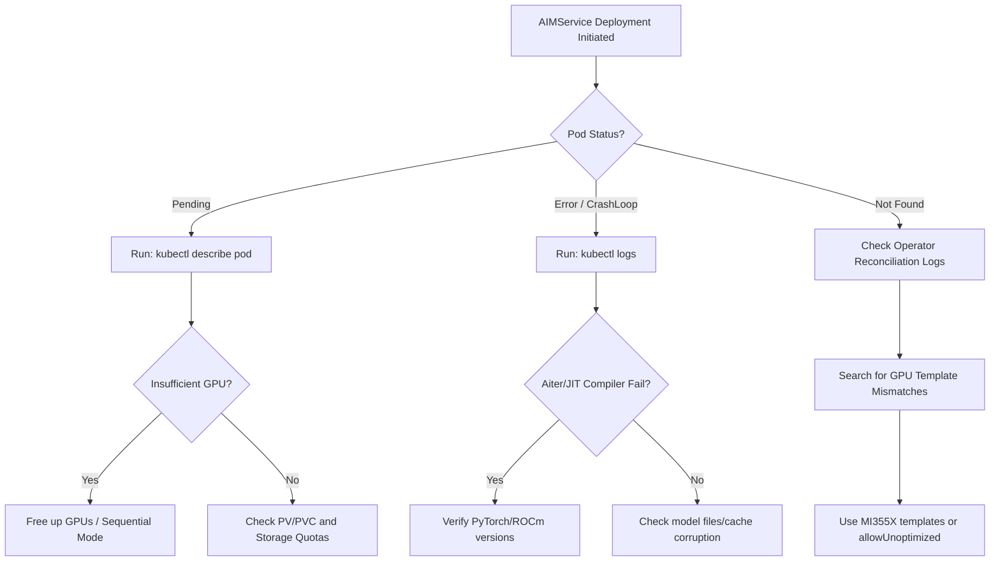

# AMD Enterprise AI (EAI) Troubleshooting Guide

This document outlines the symptoms, diagnostic flows, and resolutions for issues encountered during the BNY AMD MI355X POC deployment and verification phases.

---

## 1. Diagnostics Flow Overview

The following workflow illustrates the general debugging path for any failing `AIMService` or `AIMModelCache` resources:



---

## 2. Issue Categories & Resolutions

### Issue 1: Model Template Mismatch / GPU Model Restriction

> [!IMPORTANT]
> **Symptom**: `AIMService` is created but the corresponding predictor pod is never scheduled, or the custom resource status reports configuration errors. Checking the operator logs (`kaiwo-controller-manager`) reveals template validation errors for the `mi355` GPU model.

#### Debugging Flow for Template Mismatch

1. Run the service diagnostic helper to list status:

   ```bash
   ./scripts/debug.sh --list
   ```

2. Retrieve active reconciler logs to identify the mismatch:

   ```bash
   ./scripts/debug.sh <service-name> default
   ```

3. Locate the error message in the operator logs:

   ```text
   "error": "template validation failed: gpu model mi300 requested but mi355 found in cluster"
   ```

#### Resolution for Template Mismatch

By default, the EAI operator catalog templates are optimized for specific hardware profiles (e.g. `mi300`). This repository's normal POC flow avoids that mismatch by applying custom MI355X `AIMClusterServiceTemplate` resources from `scripts/bny-custom-templates.yaml` before creating model-ref `AIMService` resources.

Use the scripted path first:

```bash
./scripts/start.sh --model mixtral-8x22b
```

If you create ad hoc image-based AIMService manifests outside the scripted flow, explicitly allow the operator to use a generic/unoptimized configuration:

```yaml
apiVersion: aim.silogen.ai/v1alpha1
kind: AIMService
metadata:
  name: mixtral-8x22b
spec:
  model:
    name: mixtral-8x22b-instruct-v0-1
    image: docker.io/amdenterpriseai/aim-mistralai-mixtral-8x22b-instruct-v0-1:0.11.0
  allowUnoptimized: true
```

For the current POC manifests, verify the MI355X templates are present:

```bash
kubectl get aimclusterservicetemplates \
  | grep -E "mi355x|gpt-oss|mixtral|llama"
```

---

### Issue 2: Redundant Downloaders & Storage Quota Overflows

> [!WARNING]
> **Symptom**: Custom-built `AIMModelCache` PVCs are ignored, and the controller repeatedly spawns internet downloader jobs (e.g., `mistralai-mixtral-8x22b-instruct-v0-1-cache-download-*`) attempting to download hundreds of gigabytes from Hugging Face, resulting in `DiskPressure` or download timeouts.

#### Debugging Flow for Cache Downloads

1. Check the active cache downloaders in the namespace:

   ```bash
   kubectl get pods -n default | grep cache-download
   ```

2. Check the size of the local cached model folder on the node:

   ```bash
   kubectl exec -it <pod-name> -- du -sh /workspace/model-cache/
   ```

3. View the generated cache objects:

   ```bash
   kubectl get aimmodelcaches -n default
   ```

#### Resolution for Cache Downloads

1. Define an explicit `AIMModelCache` resource for the Hugging Face source and expected cache size:

   ```yaml
   apiVersion: aim.silogen.ai/v1alpha1
   kind: AIMModelCache
   metadata:
     name: mixtral-8x22b-cache
     namespace: default
   spec:
     runtimeConfigName: amd-aim-cluster-runtime-config
     size: 280Gi
     sourceUri: hf://mistralai/Mixtral-8x22B-Instruct-v0.1
   ```

2. Let the model-ref `AIMService` request cache usage with `cacheModel: true`:

   ```yaml
   spec:
     cacheModel: true
     model:
       ref: mixtral-8x22b-model-v11
   ```

3. Delete stale or failed Progressing cache objects only after confirming they are not actively making progress:

   ```bash
   kubectl delete aimmodelcache mistralai-mixtral-8x22b-instruct-v0-1 -n default
   ```

`scripts/start.sh` includes cache readiness checks, Hugging Face token validation, and stalled-download diagnostics. Prefer it over manually editing cache resources during normal POC runs.

---

### Issue 3: Insufficient GPU Resource Limits

> [!CAUTION]
> **Symptom**: The predictor pod is stuck in `Pending` state. Running `kubectl describe pod` reports `0/1 nodes are available: 1 Insufficient amd.com/gpu`.

#### Debugging Flow for GPU Resources

1. Inspect the GPU requests of all active services:
   - Llama 3.3: Requires 1 GPU (TP=1)
   - GPT-OSS: Requires 1 GPU (TP=1)
   - Mixtral-8x22B: Requires 8 GPUs (TP=8)

2. Total requested GPUs: $1 + 1 + 8 = 10$ GPUs.

3. Compare with physical capacity: The node only has 8 GPUs.

#### Resolution for GPU Resources

For multi-model benchmarking inside a single-node setup, you must run benchmarks sequentially or allocate GPUs statically using separate namespaces or node selector configurations:

1. Delete unused services before starting the larger benchmark:

   ```bash
   kubectl delete aimservice llama-3-3-70b gpt-oss-120b
   ```

2. Verify the pending service pod immediately transitions to `ContainerCreating`/`Running`:

   ```bash
   kubectl get pods -w
   ```

---

### Issue 4: Script Namespace and Controller Label Auto-Detection

> [!NOTE]
> **Symptom**: Running diagnostic scripts results in `controller pod not found` errors or retrieves logs from the wrong namespace.

#### Debugging Flow for Controller Detection

1. Check namespace configurations:

   ```bash
   kubectl get namespaces
   ```

2. Search for the KAIWO operator controller:

   ```bash
   kubectl get pods -A -l control-plane=kaiwo-controller-manager
   ```

#### Resolution for Controller Detection

The operator was found in the `kaiwo-system` namespace (instead of `aim-system`). The diagnostic tool `scripts/debug.sh` was updated to perform dynamic detection:

```bash
# Sourced namespace and label selector auto-detection
KAIWO_NS=$(kubectl get namespaces -o jsonpath='{.items[*].metadata.name}' | tr ' ' '\n' | grep -E 'kaiwo-system|aim-system' | head -n 1)
CONTROLLER_POD=$(kubectl get pods -n "$KAIWO_NS" -l control-plane=kaiwo-controller-manager -o jsonpath='{.items[0].metadata.name}' 2>/dev/null)
```

---

## 3. First-Request Latency & JIT Compilation

On the very first request to a newly deployed model, the `aiter` JIT compiler generates optimal HIP kernels for the specific batch/sequence length (e.g., MHA, RoPE, fused MoE kernels).

- **Expected Log Message**:

  ```text
  (Worker_TP4 pid=544) [aiter] start build [mha_varlen_fwd_fp16_...]
  (Worker_TP4 pid=544) [aiter] finish build [mha_varlen_fwd_fp16_...], cost 27.9s
  ```

- **Action**: This overhead is a one-time cost. Allow up to 30 seconds for the first token response. All subsequent requests will execute with low latency.
